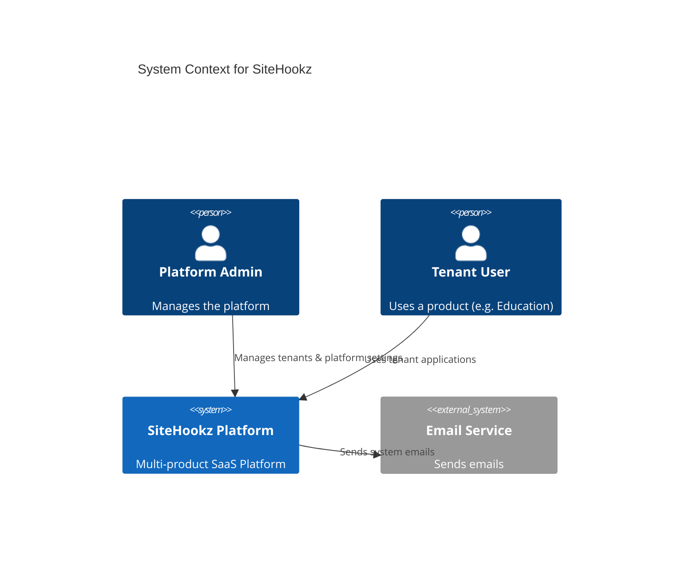
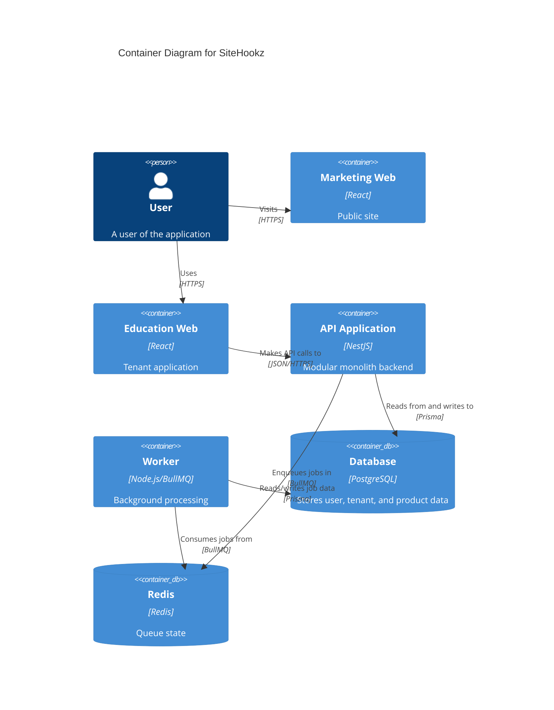
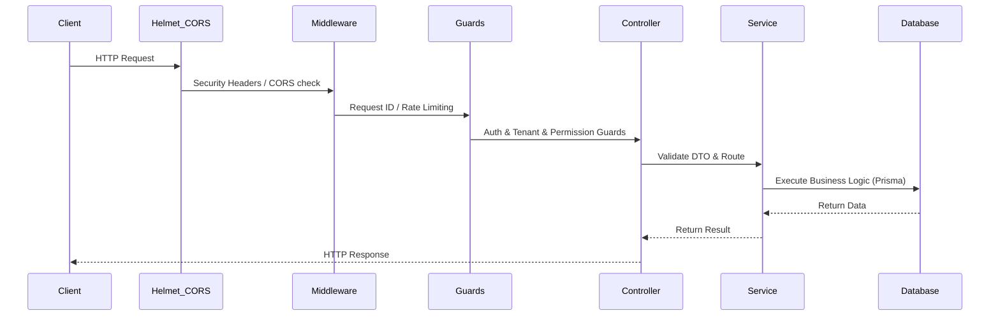
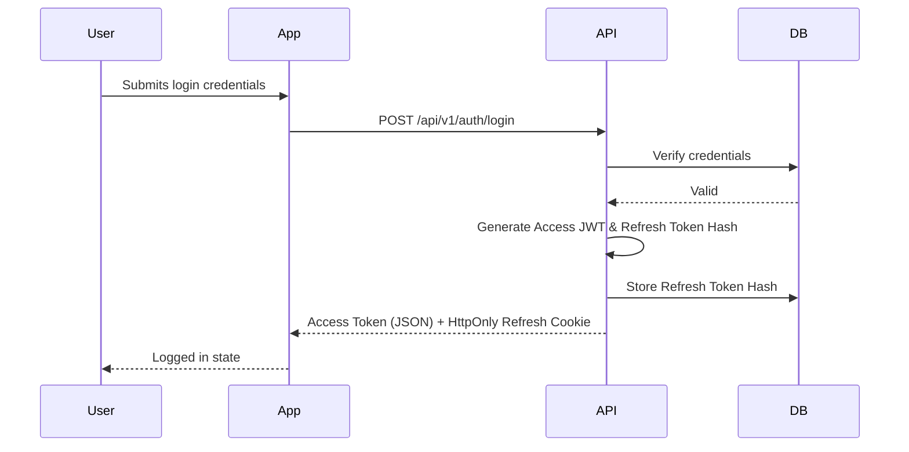
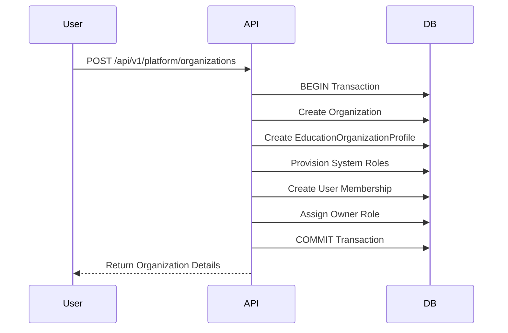
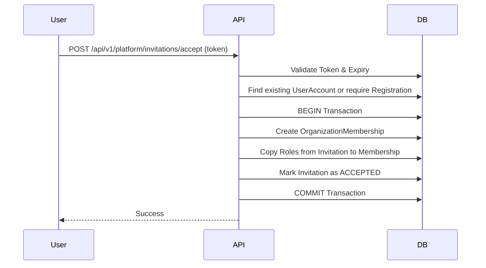
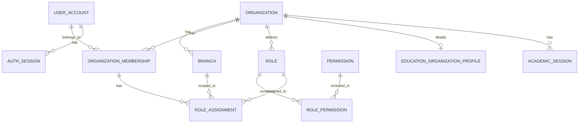

# Architecture Overview

## System Context Diagram

## Container Diagram

## Request Flow

## Auth Flow

## Organization Creation Flow

## Invitation Acceptance Flow

## Database ER Diagram (Simplified)

